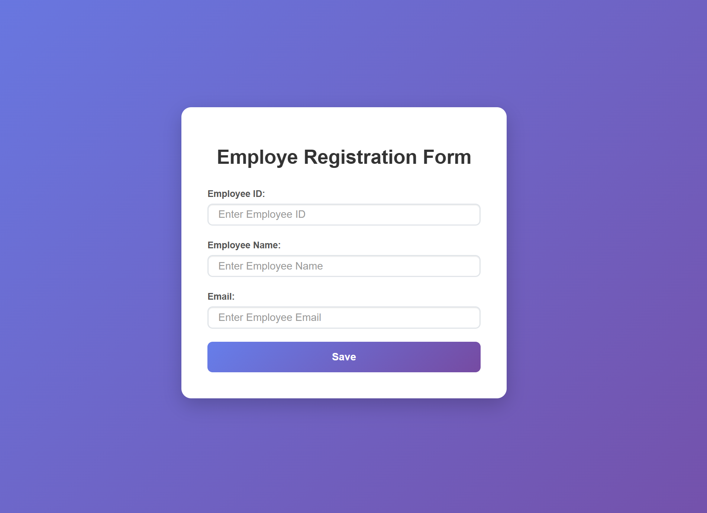

# Employee Form Application

## Table of Contents

- [Description](#description)
- [Benefits of using JsonPowerDB](#benefits-of-using-jsonpowerdb)
- [Release History](#release-history)
- [Features](#features)
- [Scope of Functionalities](#scope-of-functionalities)
- [Examples of Use](#examples-of-use)
- [Technologies Used](#technologies-used)
- [How to Run](#how-to-run)
- [API Integration](#api-integration)
- [Illustrations](#illustrations)
- [Project Status](#project-status)
- [Sources](#sources)
- [Files](#files)
- [Author](#author)

## Description

A simple web application for managing employee information with a beautiful, responsive form interface. This project demonstrates the integration of JsonPowerDB for data storage and retrieval in a front-end application.

## Benefits of using JsonPowerDB

JsonPowerDB is a high-performance, schema-free, real-time database that offers several advantages:

- **High Performance**: Provides fast data access and manipulation with minimal latency.
- **Schema-Free**: Allows flexible data structures without predefined schemas.
- **Real-Time**: Supports real-time data synchronization and updates.
- **REST API**: Easy-to-use REST APIs for CRUD operations.
- **NoSQL Database**: Handles JSON data efficiently, making it ideal for web applications.
- **Scalable**: Can handle large volumes of data and concurrent users.

## Features

- Employee ID, Name, and Email input fields
- Form validation with alerts
- Data submission to a remote API
- Bootstrap-based responsive design
- Custom CSS styling for enhanced appearance

## Scope of Functionalities

The application provides the following functionalities:

- **Form Input**: Users can enter employee details including ID, name, and email.
- **Validation**: Client-side validation ensures required fields are filled.
- **Data Submission**: Submits data to JsonPowerDB via REST API.
- **User Feedback**: Displays alerts for validation errors and submission results.
- **Responsive Design**: Works on various screen sizes using Bootstrap.

## Examples of Use

1. **Adding a New Employee**:
   - Open the application in a web browser.
   - Enter Employee ID (e.g., "EMP001").
   - Enter Employee Name (e.g., "John Doe").
   - Enter Employee Email (e.g., "john.doe@example.com").
   - Click "Save" to submit the data.

2. **Form Validation**:
   - If any required field is empty, an alert will prompt the user to fill it.
   - The focus will automatically move to the empty field.

## Technologies Used

- HTML5
- CSS3
- JavaScript (jQuery)
- Bootstrap 3.4.1
- JsonPowerDB (via Login2Explore API)

## How to Run

1. Clone the repository: `git clone https://github.com/BADDEEP007/jsonpowereddb.git`
2. Open `index.html` in a web browser
3. Fill in the employee details
4. Click the "Save" button to submit the data

## API Integration

The application connects to the Login2Explore API at `http://api.login2explore.com:5577` to store employee data in the "SAMPLE" database under the "EMP-REL" relation.

## Illustrations

*Figure 1: Screenshot of the Employee Form Application*

## Project Status

**Completed** - The project is fully functional and ready for use. Future enhancements may include additional CRUD operations (Read, Update, Delete).

## Sources

- [Bootstrap](https://getbootstrap.com/docs/3.4/)
- [jQuery](https://jquery.com/)
- [JsonPowerDB Documentation](https://login2explore.com/jpdb/docs.html)

## Files

- `index.html`: Main HTML structure
- `styles.css`: Custom CSS styling
- `javascript.js`: Form validation and API interaction logic
- `README.md`: Project documentation

## Author

Pradeep Argal